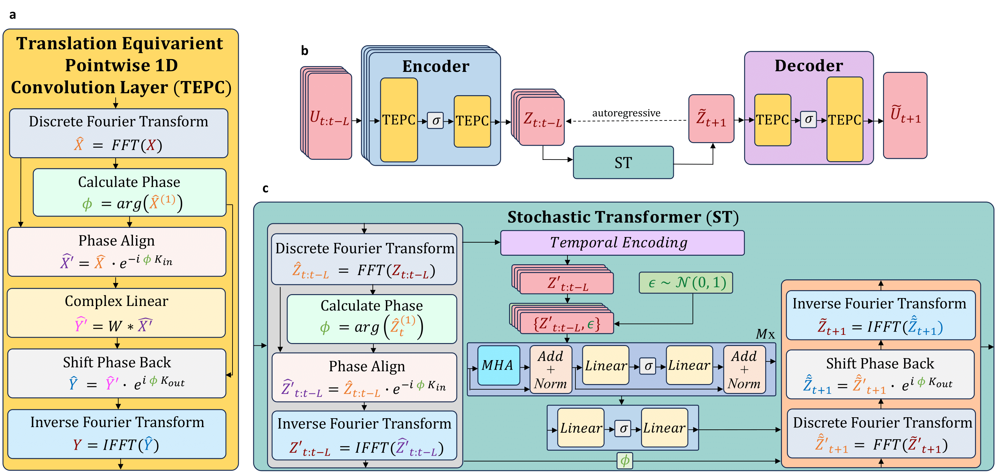
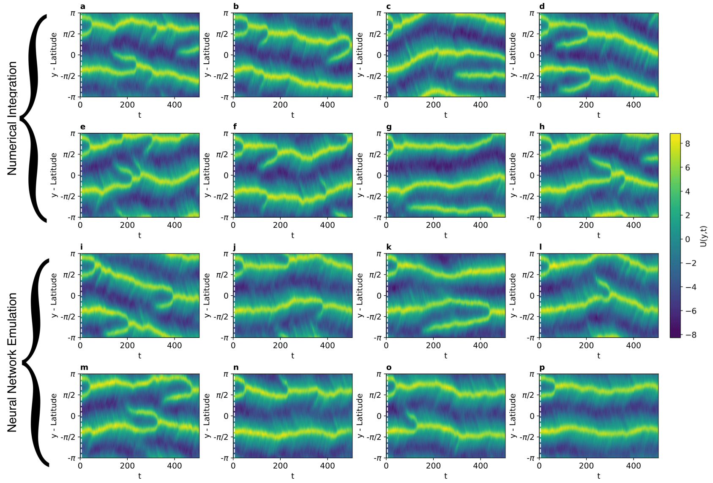

# Stochastic Latent Transformer

This repository contains the code for the paper: [Stochastic Latent Transformer: Efficient Modelling of Stochastically Forced Zonal Jets](https://arxiv.org/abs/2310.16741)

## Stochastic Latent Transformer Model Architecture



## Latidude-time plots displaying jets generated via numerical integration and by the Stochastic Latent Transformer


## Files

 - Directory [`src`](https://github.com/Ira-Shokar/Stochastic_Latent_Transformer/tree/main/src) contains the python scripts to define and train the Stochatic Latent Transformer using [Pytorch](https://github.com/pytorch/pytorch).
    - [`src/nn.py`](https://github.com/Ira-Shokar/Stochastic_Latent_Transformer/tree/main/src/nn.py)  defines the Translation Equivarient Pointwise 1D Convolution (TEPC) layers as well as the Multihead_Attention operation and the Attention_Block.
    - [`src/models.py`](https://github.com/Ira-Shokar/Stochastic_Latent_Transformer/tree/main/src/models.py) defines Autoencoder and Stochatic Transformer architectures.
    - [`src/SLT.py`](https://github.com/Ira-Shokar/Stochastic_Latent_Transformer/tree/main/src/SLT.py)  defines Stochastic_Latent_Transformer, the contains the training and validation loops, loss function and other training utilities. It also contains model loading, the hellinger_distance_3D evaluation metric and the inference function to generate new trajectories using the Stochastic Latent Transformer.
    - [`src/train.py`](https://github.com/Ira-Shokar/Stochastic_Latent_Transformer/tree/main/src/train.py) defines model and training hyperparameters, loads training data and fits the model.
    - [`src/eval.py`](https://github.com/Ira-Shokar/Stochastic_Latent_Transformer/tree/main/src/eval.py) loads trained models, forecasts new trajectories from a set of inital condtions and plots the outputs.
    - [`src/utils.py`](https://github.com/Ira-Shokar/Stochastic_Latent_Transformer/tree/main/src/utils.py) defines utilities used during training and evaluation.
    - Directory [`vae`](https://github.com/Ira-Shokar/Stochastic_Latent_Transformer/tree/main/src/vae) defines training of the temporal VAE and adversarial training for comaparison.

- Directory [`notebooks`](https://github.com/Ira-Shokar/Stochastic_Latent_Transformer/tree/main/notebooks) contains notebooks used for evaluation.
    - [`notebooks/evaluation.ipynb`](https://github.com/Ira-Shokar/Stochastic_Latent_Transformer/tree/main/notebooks/evaluation.ipynb) loads trained models, forecasts new trajectories from a set of inital condtions and plots the outputs before some evaluative metrics.
    - [`notebooks/jet_transitions.ipynb`](https://github.com/Ira-Shokar/Stochastic_Latent_Transformer/tree/main/notebooks/jet_transitions.ipynb) plots PDFs for determaning properties of spontaneous transition events.

- Directory [`QGF`](https://github.com/Ira-Shokar/Stochastic_Latent_Transformer/tree/main/QGF) contains the julia scripts used to generate the numerical integrations of the beta-plane turbulence model in 2D using [GeophysicalFlows.jl](https://github.com/FourierFlows/GeophysicalFlows.jl).
    - [`QGF/forced_beta_SL.jl`](https://github.com/Ira-Shokar/Stochastic_Latent_Transformer/tree/main/QGF/forced_beta_SL.jl) defines the model parameters and forcing for a Quasi-geostrophic flow on a 2D periodic beta-plane and integrates using a pseudo-spectral solver .
    - [`QGF/plots_SL.jl`](https://github.com/Ira-Shokar/Stochastic_Latent_Transformer/tree/main/QGF/plots_SL.jl) reads the JLD2 files output from [`QGF/forced_beta_SL.jl`](https://github.com/Ira-Shokar/Stochastic_Latent_Transformer/tree/main/QGF/forced_beta_SL.jl) and plots latitude-time plots of zonally-averaged zonal velocity (U) as well as the assocaited fields and saves the time evolution of U as a csv.

## Datasets
We provide the training data output from [`QGF/forced_beta_SL.jl`](https://github.com/Ira-Shokar/Stochastic_Latent_Transformer/tree/main/QGF/forced_beta_SL.jl) used for training in [`src/train.py`](https://github.com/Ira-Shokar/Stochastic_Latent_Transformer/tree/main/src/train.py) in the following Zenodo repositoy: [](https://doi.org/10.5281/zenodo.10034268)

We provide the evaluation data output from [`QGF/forced_beta_SL.jl`](https://github.com/Ira-Shokar/Stochastic_Latent_Transformer/tree/main/QGF/forced_beta_SL.jl) used for testing in [`src/eval.py`](https://github.com/Ira-Shokar/Stochastic_Latent_Transformer/tree/main/src/eval.py), [`notebooks/evaluation.ipynb`](https://github.com/Ira-Shokar/Stochastic_Latent_Transformer/tree/main/notebooks/evaluation.ipynb) and [`notebooks/jet_transitions.ipynb`](https://github.com/Ira-Shokar/Stochastic_Latent_Transformer/tree/main/notebooks/jet_transitions.ipynb) in the Zenodo repositoy: [](https://doi.org/10.5281/zenodo.10034268)

## Models
We provide the trained STL model in the form of a torchscript object, that can is evaluated using [`src/eval.py`](https://github.com/Ira-Shokar/Stochastic_Latent_Transformer/tree/main/src/eval.py), [`notebooks/evaluation.ipynb`](https://github.com/Ira-Shokar/Stochastic_Latent_Transformer/tree/main/notebooks/evaluation.ipynb) and [`notebooks/jet_transitions.ipynb`](https://github.com/Ira-Shokar/Stochastic_Latent_Transformer/tree/main/notebooks/jet_transitions.ipynb), in the Zenodo repositoy: 

## Citations

If you use Stochatic Latent Transformer please cite:

```
@misc{shokar2023stochastic,
      title={Stochastic Latent Transformer: Efficient Modelling of Stochastically Forced Zonal Jets}, 
      author={Ira J. S. Shokar and Rich R. Kerswell and Peter H. Haynes},
      year={2023},
      eprint={2310.16741},
      archivePrefix={arXiv},
      primaryClass={cs.LG}
}
```

